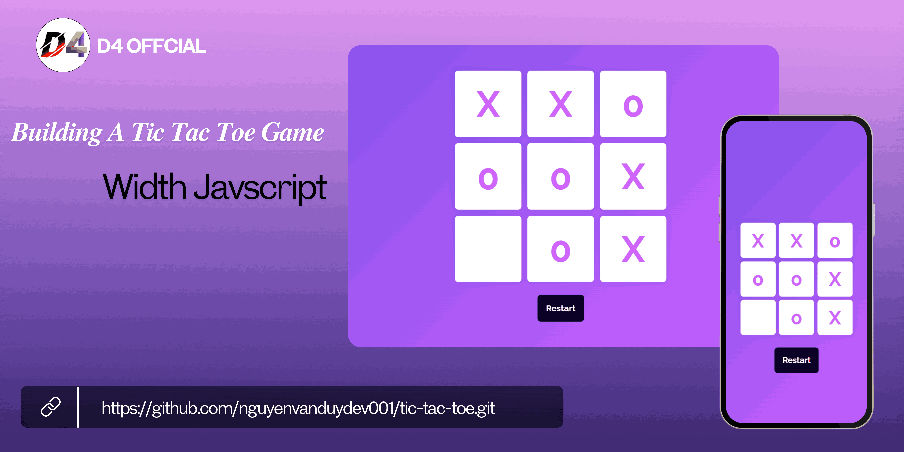

# Building A Tic Tac Toe Game

## Demo


## Installation instructions

```
git clone https://github.com/nguyenvanduydev001/tic-tac-toe.git
```
----

## Basic Features of the Tic-Tac-Toe Game
The Tic-Tac-Toe game, suitable for two players, is simple to play but demands a little strategy. Here are its main features:

1. Implement the game logic and user interface.
2. Add difficulty levels or multiplayer options.
3. Customization, which lets players choose different board sizes or symbols.
   
Games will make you start thinking of certain algorithms, data structures, and optimizations in JavaScript, and games like the Tic-Tac-Toe game are one of them.

[Live demo](https://tic-tac-toe-nvd.netlify.app/)
